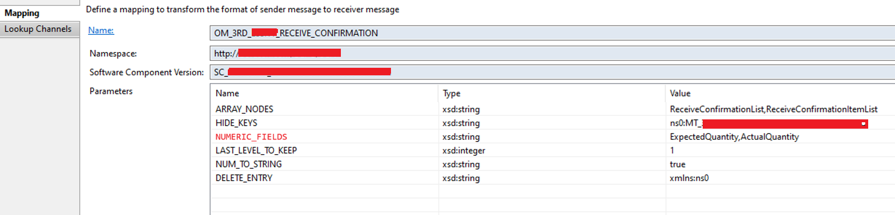
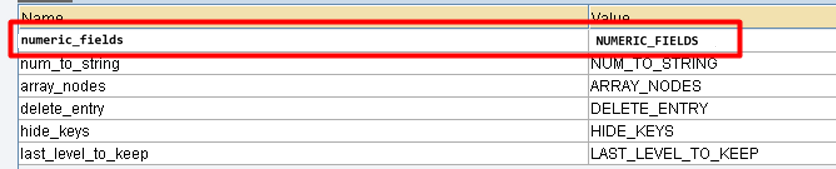

# XML2JSON_Conversion_JAVA_SAP_PI
Java Mapping to convert XML to JSON in SAP PI

### what is improved over RoyKiran's development?
Imagine there is a case you need to convert some of the numeric values to string but not all of them. 
now there is a new operation mapping parameter named NUMERIC_FIELDS which help us this with problem.
When coma separated field names assigned to the NUMERIC_FIELDS parameter (NUM_TO_STRING parameter should be true),
those fields will not be converted to the string

### Iflow Configuration

### Operation Mapping Configuration
